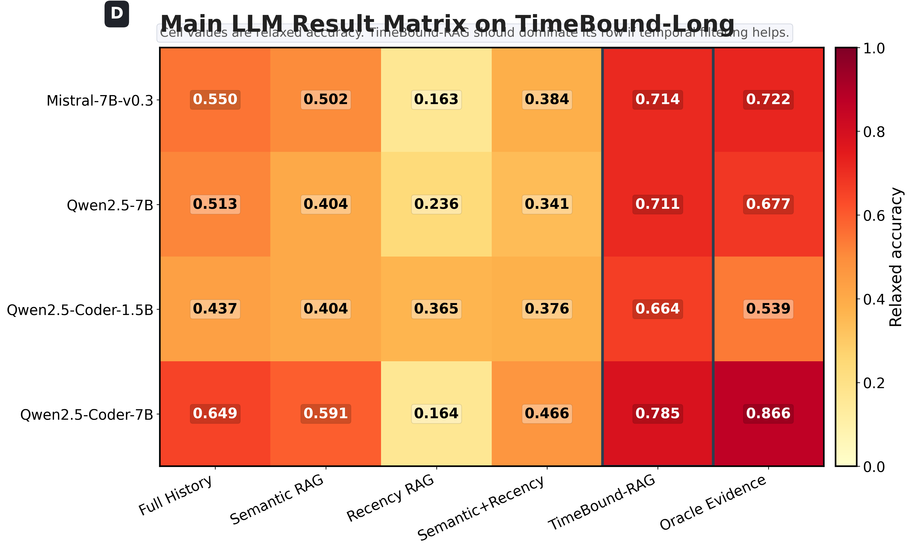

# TimeBound

**TimeBound** is a benchmark and experimental suite for evaluating **temporal grounding in long-term memory and retrieval-augmented LLM agents**.

The project focuses on a failure mode that standard RAG often misses: an agent may retrieve a semantically similar memory, but that memory can be **outdated, cancelled, superseded, expired, or valid only inside a specific time window**. TimeBound tests whether retrieval and generation pipelines can identify the **currently operative fact**, not just the most textually similar one.

<p align="center">
  
</p>

---

## What is in this repository?

This repository contains:

- a generated temporal-memory benchmark: **TimeBound-Long**
- retrieval-only baselines
- TimeBound-RAG scoring baselines
- ablations over temporal metadata and score components
- local LLM reader evaluations
- external diagnostic conversions and summaries
- paper-ready tables, figures, logs, and qualitative case studies

The repository is intended to make the experiments inspectable and reproducible without redistributing large model weights or raw public datasets.

---

## Core idea

A normal semantic retriever may retrieve this:

> “Mira’s meeting is planned for 2026-01-16 19:00.”

But if a later memory says:

> “Update: Mira’s meeting is now planned for 2026-01-16 21:00 instead.”

then a temporal-memory system must select the later valid update.

TimeBound evaluates this through questions such as:

```text
When is Mira's meeting now planned?
````

with metadata-aware memories:

```text
turn_id
observation_time
event_time
valid_from
valid_to
status
relation
text
```

The key distinction is:

```text
Semantic relevance is not enough.
A memory must also be temporally valid and operational at query time.
```

---

## Main benchmark

The main benchmark is:

```text
synthetic/timebound_long.jsonl
```

It contains:

```text
1,000 examples
8 temporal task families
125 examples per family
15–46 memory events per example
1–2 gold evidence turns per query
```

Task families include:

```text
aging_facts
cancellation
conflicting_updates
delayed_observations
elapsed_time_reasoning
periodic_events
rescheduling
time_window_retrieval
```

Each example contains a temporally annotated history, a final query, a gold answer, and gold evidence turns.

---

## Repository layout

```text
TimeBound/
├── synthetic/
│   └── timebound_long.jsonl
│
├── release/
│   └── timebound_benchmark/
│
├── scripts/
│   ├── dataset generation
│   ├── external conversion
│   ├── retrieval baselines
│   ├── LLM reader suite
│   ├── parser fix / rescoring
│   └── plot generation
│
├── stats/
│   ├── dataset summaries
│   ├── run plans
│   ├── suite summaries
│   └── fixed final metrics
│
├── tables/
│   ├── table_main_retrieval_fixed.csv
│   ├── table_main_llm_timebound_fixed.csv
│   └── table_external_diagnostics_fixed.csv
│
├── outputs/
│   └── suite82/
│       ├── A_* retrieval-only runs
│       ├── B_* ablation runs
│       └── C_* main LLM reader runs
│
├── PLOTS_WOW/
│   └── paper-style quantitative figures
│
├── PLOTS_QUALITATIVE/
│   └── qualitative case-study panels
│
├── paper_ready/
│   └── paper-ready tables, summaries, and exported materials
│
└── logs/
    └── execution logs
```

Large model weights, raw external datasets, virtual environments, and public raw data dumps are intentionally excluded.

---

## Key results

### Main retrieval-only result

TimeBound-RAG reduces invalid memory retrieval while remaining competitive in evidence F1.

```text
Retriever          Evidence F1    Invalid retrieval rate
--------------------------------------------------------
Semantic RAG       0.5768         0.3737
TimeBound-RAG      0.5415         0.1517
Recency            0.0000         0.3297
Chronological      0.0000         0.3403
Oracle Evidence    1.0000         0.4375
```

Interpretation:

```text
Semantic retrieval finds similar memories, but often retrieves stale or invalid facts.
TimeBound-RAG retrieves fewer invalid memories and gives better downstream LLM answers.
```

---

### Main LLM reader result

Four local open-weight readers were evaluated:

```text
Qwen2.5-Coder-1.5B-Instruct
Qwen2.5-Coder-7B-Instruct
Qwen2.5-7B-Instruct
Mistral-7B-Instruct-v0.3
```

Main TimeBound-Long relaxed accuracy:

```text
Model                  Semantic RAG    TimeBound-RAG    Gain
------------------------------------------------------------
Mistral-7B-v0.3        0.502           0.714            +0.212
Qwen2.5-7B             0.404           0.711            +0.307
Qwen2.5-Coder-1.5B     0.404           0.664            +0.260
Qwen2.5-Coder-7B       0.591           0.785            +0.194
```

Mean result:

```text
Semantic RAG mean relaxed accuracy:   0.475
TimeBound-RAG mean relaxed accuracy:  0.719
Mean gain:                            +0.244
```

Compared with full-history prompting:

```text
Full History mean relaxed accuracy:   0.537
TimeBound-RAG mean relaxed accuracy:  0.719
Mean gain:                            +0.181
```

This suggests that temporal filtering is more useful than simply increasing context length.

---

## Quantitative figures

The `PLOTS_WOW/` directory contains publication-style figures:

```text
01_main_retrieval_scoreboard.png/.pdf
02_retrieval_tradeoff_scatter.png/.pdf
03_topk_sensitivity_timebound.png/.pdf
04_main_llm_heatmap.png/.pdf
05_timebound_vs_semantic_gain.png/.pdf
06_main_llm_leaderboard.png/.pdf
07_score_component_ablation.png/.pdf
08_metadata_ablation.png/.pdf
09_external_diagnostics_heatmap.png/.pdf
10_context_vs_accuracy.png/.pdf
```

Recommended main-paper figures:

```text
PLOTS_WOW/04_main_llm_heatmap.pdf
PLOTS_WOW/05_timebound_vs_semantic_gain.pdf
PLOTS_WOW/02_retrieval_tradeoff_scatter.pdf
```

---

## Qualitative figures

The `PLOTS_QUALITATIVE/` directory contains case-study panels:

```text
01_semantic_fail_timebound_win_cards.png/.pdf
02_one_case_four_readers_storyboard.png/.pdf
03_full_history_vs_timebound_cases.png/.pdf
04_temporal_evidence_timeline.png/.pdf
05_timebound_failure_gallery.png/.pdf
```

These figures show concrete examples where semantic retrieval selects outdated or irrelevant facts, while TimeBound-RAG selects temporally operative evidence.

Recommended main-paper qualitative figures:

```text
PLOTS_QUALITATIVE/01_semantic_fail_timebound_win_cards.pdf
PLOTS_QUALITATIVE/04_temporal_evidence_timeline.pdf
```

---

## Experimental suite

The final experimental plan contains **82 runs**:

```text
A. Main retrieval-only runs
   6 runs

B. Retrieval ablations
   18 runs

C. Main LLM reader runs on TimeBound-Long
   24 runs

D. External diagnostics
   34 runs

Total
   82 runs
```

Breakdown:

```text
A_main_retrieval:
  semantic
  recency
  semantic_recency
  chronological
  timebound
  oracle

B_retrieval_ablations:
  score components
  metadata removal
  top-k sensitivity

C_main_llm_timebound:
  4 readers × 6 regimes

D_external_diagnostics:
  TempReason
  ComplexTR
  TCP
  LoCoMo
```

---

## Reader regimes

The main LLM reader suite evaluates:

```text
full_history
semantic_rag
recency_rag
semantic_recency_rag
timebound_rag
oracle_evidence
```

Where:

```text
full_history
  provides the whole memory history

semantic_rag
  retrieves top-k memories by lexical semantic similarity

recency_rag
  retrieves the most recent memories

semantic_recency_rag
  combines semantic similarity and recency

timebound_rag
  combines semantic, temporal-validity, status, and relation signals

oracle_evidence
  provides gold evidence turns
```

---

## TimeBound-RAG scoring

TimeBound-RAG scores each memory using a combination of:

```text
semantic relevance
temporal validity
status / operational state
relation links
```

The goal is not only to retrieve semantically related text, but to avoid memories that are:

```text
cancelled
expired
superseded
not yet valid
outside the queried time window
```

---

## Dataset format

Each TimeBound-Long example is a JSON object.

Simplified example:

```json
{
  "id": "rescheduling_0783",
  "task_type": "rescheduling",
  "query_time": "2026-01-06 10:00",
  "query": "When is Priya's delivery after rescheduling?",
  "gold_answer": "2026-01-12 20:00",
  "gold_evidence_turns": ["T5"],
  "history": [
    {
      "turn_id": "T1",
      "observation_time": "2026-01-05 09:00",
      "event_time": "2026-01-10 18:00",
      "valid_from": "2026-01-05 09:00",
      "valid_to": "2026-01-06 09:00",
      "status": "superseded",
      "relation": null,
      "text": "Priya's delivery is planned for 2026-01-10 18:00."
    },
    {
      "turn_id": "T5",
      "observation_time": "2026-01-06 09:00",
      "event_time": "2026-01-12 20:00",
      "valid_from": "2026-01-06 09:00",
      "valid_to": null,
      "status": "active",
      "relation": "updates:T1",
      "text": "Priya moved the delivery from 2026-01-10 18:00 to 2026-01-12 20:00."
    }
  ]
}
```

---

## Quick start

Clone the repository:

```bash
git clone https://github.com/cataug/TimeBound.git
cd TimeBound
```

Create a Python environment:

```bash
python -m venv .venv
source .venv/bin/activate
pip install numpy pandas matplotlib
```

For local LLM runs, install a compatible PyTorch + Transformers stack separately:

```bash
pip install torch transformers accelerate safetensors
```

The repository does not include model weights.

---

## Inspect the benchmark

```bash
python - <<'PY'
import json
from pathlib import Path

path = Path("synthetic/timebound_long.jsonl")

with path.open("r", encoding="utf-8") as f:
    for i, line in enumerate(f):
        ex = json.loads(line)
        print("ID:", ex["id"])
        print("Task:", ex["task_type"])
        print("Query:", ex["query"])
        print("Gold:", ex["gold_answer"])
        print("Gold evidence:", ex["gold_evidence_turns"])
        print("History turns:", len(ex["history"]))
        print()
        if i >= 2:
            break
PY
```

---

## Regenerate the 82-run plan

```bash
python scripts/20_make_run_plan_82.py
```

This writes:

```text
stats/run_plan_82.csv
```

---

## Run retrieval-only experiments

```bash
python scripts/21_run_suite_82.py \
  --plan stats/run_plan_82.csv \
  --out outputs/suite82 \
  --block A_main_retrieval \
  --block B_retrieval_ablations
```

Outputs:

```text
outputs/suite82/<run_id>/predictions.jsonl
outputs/suite82/<run_id>/metrics_overall.json
outputs/suite82/<run_id>/metrics_by_task.csv
stats/suite82_summary.csv
tables/table_main_retrieval.csv
```

---

## Run main LLM reader experiments

Before running LLM experiments, place local model directories under `models/`, for example:

```text
models/Qwen__Qwen2.5-Coder-1.5B-Instruct
models/Qwen__Qwen2.5-Coder-7B-Instruct
models/Qwen__Qwen2.5-7B-Instruct
models/mistralai__Mistral-7B-Instruct-v0.3
```

Then run:

```bash
python scripts/21_run_suite_82.py \
  --plan stats/run_plan_82.csv \
  --out outputs/suite82 \
  --block C_main_llm_timebound
```

If generation outputs include chat role labels such as `assistant`, run the parser-fix rescoring script:

```bash
python scripts/22_fix_llm_prediction_parser_and_rescore.py
```

Final corrected summaries are written to:

```text
stats/suite82_summary_fixed.csv
tables/table_main_llm_timebound_fixed.csv
tables/table_external_diagnostics_fixed.csv
```

---

## Run external diagnostics

External raw datasets are not redistributed in this repository.

If the external converted files are available locally, run:

```bash
python scripts/21_run_suite_82.py \
  --plan stats/run_plan_82.csv \
  --out outputs/suite82 \
  --block D_external_diagnostics
```

External diagnostics are intended as stress probes, not as direct leaderboard comparisons.

---

## Generate figures

Quantitative figures:

```bash
python scripts/30_make_wow_plots.py
```

Qualitative panels:

```bash
python scripts/31_make_qualitative_panels.py
```

Outputs:

```text
PLOTS_WOW/
PLOTS_QUALITATIVE/
```

---

## Important files

### Main benchmark

```text
synthetic/timebound_long.jsonl
```

### Final summaries

```text
stats/suite82_summary_fixed.csv
tables/table_main_retrieval_fixed.csv
tables/table_main_llm_timebound_fixed.csv
tables/table_external_diagnostics_fixed.csv
```

### Run plan

```text
stats/run_plan_82.csv
```

### Main scripts

```text
scripts/20_make_run_plan_82.py
scripts/21_run_suite_82.py
scripts/22_fix_llm_prediction_parser_and_rescore.py
scripts/30_make_wow_plots.py
scripts/31_make_qualitative_panels.py
```

---

## Reproducibility notes

The repository contains the generated TimeBound-Long benchmark and completed experiment outputs for the main benchmark.

The following are intentionally excluded:

```text
raw public external datasets
local model weights
Hugging Face cache
virtual environments
large archives
API keys or credentials
```

This keeps the repository lightweight and safe for public release.

---

## Project status

Current release contents:

```text
TimeBound-Long benchmark
82-run experimental suite
fixed LLM parser/rescoring outputs
retrieval-only baselines
LLM reader baselines
ablation studies
external diagnostic summaries
paper-ready tables
quantitative figures
qualitative case panels
```

The main takeaway:

```text
Temporal filtering matters.
Across four local readers, TimeBound-RAG improves mean relaxed accuracy from 0.475 with Semantic RAG to 0.719, while using compact retrieved context.
```

```
```

[1]: https://github.com/cataug/TimeBound "GitHub - cataug/TimeBound · GitHub"
